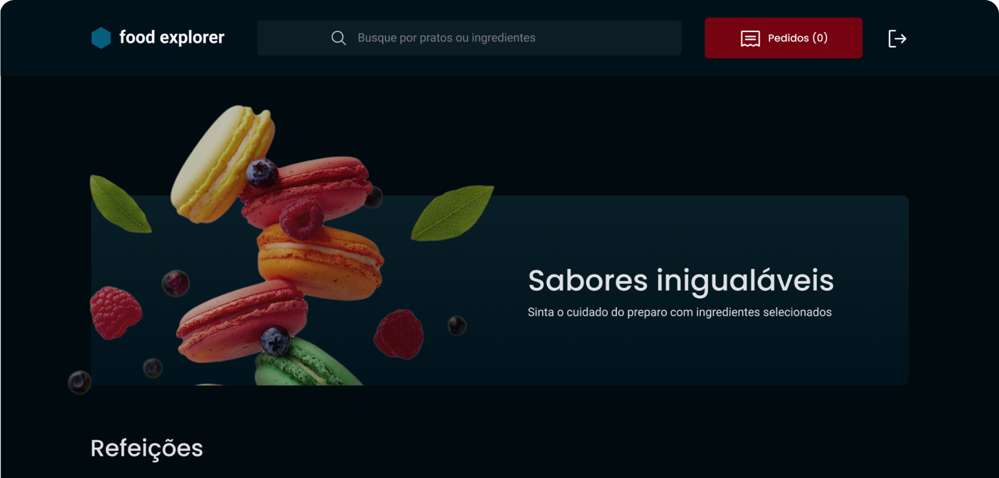

# Food Explorer

___

## 💻 About
Food Explorer is a restaurant web application. After registering on the platform, the user will be able to create orders and monitor their status. There is also profile customization, favorites filtering, a search field and a contact section with the restaurant. The cart is 100% functional and the user can choose between 2 payment methods (card or Pix). The Administrator will have the ability to create/edit/remove dishes as desired. He can also change the status of orders, according to their preparation line in the kitchen. This status will be immediately updated on the consumers' screen. The project has several "extras" that I added, such as the possibility of changing the page theme, customizing the user profile (avatar, name and password), it also has several visual effects and most important of all: It is responsive to use on different types of devices!

This repository contains data from the Frontend of my application in React.js and the BackEnd in Node.js.

___
